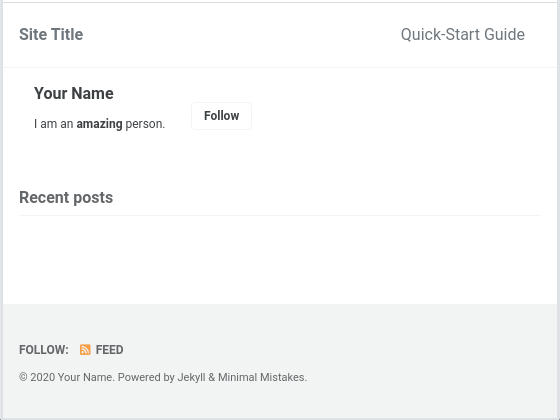

In this article, we'll walkthrough how to setup a jekyll powered blog using the Minimal mistakes theme.

# STATIC SITE GENERATOR
- JAM stack
- Fast, security, ..
- Some famous static site generator
- Theme available, fast build, fast maintaince

We have a lot of static site generators, check out on [staticgen.com](https://www.staticgen.com/)

## Jekyll

### Why I choose Jekyll
- Ruby developer
- Compatible with Github pages
- We will you Jekyll and the github pages to create our blog

### Infomations of Jekyll

Jekyll is a simple, blog-aware, static site generator. It takes a template directory containing raw text files in various formats, runs it through a converter (like Markdown) and its Liquid renderer, and spits out a complete, ready-to-publish static website suitable for serving with your favorite web server. Jekyll is also the engine behind GitHub Pages, which means you can use Jekyll to host your project’s page, blog, or website from GitHub’s servers for free.

It’s not always clear why we need need a personal website. But here’s the truth: we are a product (a brand) with unique skills to offer to prospective employees and customers. A website is an effective medium to let the world know who we are, what we are capable of, and what our values are. 

I need a website to:

Showcase my projects,
Blog about programming and my other interests, and
Share information about me that would be of interest to a recruiter, including my resume, email, and links to my Github, Medium, and LinkedIn pages.

Being able to easily generate and publish blog posts is another extremely beneficial, but not required featured.

One day I watched a talk on YouTube by a content management system (CMS) evangelist. He discussed the benefits of using a CMS to generate a website composed of content from markdown and text files. This promotes separation of content from code and better security and speed at which content is delivered. Some CMS are either git-backed or talk to an API.

I researched different options for static site generators. My criteria are:

Speed - This includes speed of development (getting a website up and running quickly), and the performance of the website at delivering content.
Popularity - A very important but often overlooked aspect of choosing a technology is how many people use it. When a technology is popular, you’d be able to get more community support (e.g. StackOverflow, tutorials, sample projects) and the creators of the tools have an incentive to continue to support and improve upon their product.
Customization - This is a fringe criterion. Style and uniqueness of the website are not super important for me. I want my website to be a place to share information about me and having too unique of a website could make it more difficult for visitors of the website to find information. Still, it’d be nice if I have the option to choose from different layouts for my website and some customization like fonts.

Jekyll: Built with Ruby and uses Liquid templates. Very popular, created by the founder of Github, and offers free hosting on Github.

# INSTALLATION & BUILD

There are multiple ways to get started with Jekyll, each with its own variations. Here a few options:
- Install Jekyll locally via the command line, create a new boilerplate website using `jekyll new`, build it locally with `jekyll build`, then serve it. Make sure you installed jekyll on your machine `gem install bundler jekyll`. For the full installation, you can check out on the official guide [**jekyllrb.com**](https://jekyllrb.com/).
- Take a Jekyll theme and clone it to your local machine, install Jekyll locally via the command line, make updates to your website, build it locally, and then serve it. (You can also fork a starting point and make changes it)

We'll get start with the easiest option: Take a available theme of Jekyll. This will only get us up and running in a few minutes.

**So, let's choose a theme together**

Nowadays, there are a lot of Jekyll themes, both free and paid. Developers are design the templates perfectly for any corporate business and blogging website. You can check somes execellent paid Jekyll themes [here](https://themeforest.net/category/static-site-generators?clickid=TBN2XOQfVxyOTEOwUx0Mo3EHUkiWRC0dN0eB0o0&iradid=275988&iradtype=ONLINE_TRACKING_LINK&irgwc=1&irmptype=mediapartner&irpid=2056025&utm_campaign=af_impact_radius_2056025&utm_medium=affiliate&utm_source=impact_radius).

But as the title I wrote, we will build our website without paying anything, we'll choose only the free themes. 

You can found almost the free Jekyll themes on the [Free Jekyll Themes](https://jekyllthemes.io/free) and choose the one you prefer. It depends on the purpose of website that you want to bluid for example blog, porfolio, landing page, multi-purpose ...

## Minimal mistakes Jekyll theme

Before writing this article, I really want to create a professionaly blog using the static site technology. After some searches, I found a really good one for a blog and I want to make a demo Jekyll with this awesome theme.

Its advantages:
  - Free theme
  - Very recommended by community: 7k starts and 12k forks on github [Source Github mmistakes](https://github.com/mmistakes/minimal-mistakes)
  - Full features for blog.
  - Compatible with GitHub Pages.
  - Support for Jekyll's built-in Sass/SCSS preprocessor.
  - Nine different skins (color variations).
  - Several responsive layout options (single, archive index, search, splash, and paginated home page).
  - Commenting support (powered by Disqus, Facebook, Google+, Discourse, static-based via Staticman, and utterances).
  - Google Analytics support.

We have already a starting point, now we need to install this theme on your machine.

## Clone Minimal mistakes theme to your machine

As we will use the Github page to serve our blog. So,before we clone it on the local machine, I will present how I create a new repository on github. 

You may probably no need to do the same way because there are many differents ways to do it. This way is just a simpler way for me.

### Init repository on the local machine
- Create a repository on Github
  
  I don't use the `git init` via the command line, but I create directely it on github.

  
  

  With this way, we can define easily the visibility of repos: public or private and we can initialize with the template of `.gitingore` and `LICENSE`.
  I named this repo [demo-jekyll-mmtakes](https://github.com/tienduy-nguyen/demo-jekyll-mmistakes)

- After we clone the reposiroty that we just created with `git clone` on local machine.
- Now, we will clone [mmistakes repository](https://github.com/mmistakes/minimal-mistakes)
- Enter in the directory of mmistakes, remove **.git**, **LICENSE**, and **README** file
- Then we move all files in mmistakes directory to our local repository: **demo-jekyll-mmistakes**
- Don't hesitate to make a git commit when you finish that step with a message "Init mmistake theme" for example.

### Setup

First, let’s make sure that your development environment is ready.

-,Make sure you installed [Ruby](https://www.ruby-lang.org/en/) and [Ruby gems](https://rubygems.org/), and [Jekyll](https://jekyllrb.com/) on your computer.
- You’ll be using your own text editor and terminal app.
- When your development is ready, you can try run server to look your page how it is.
  
  Use `bundle install` to install all gems dependencies, and `jekyll serve` or `bundle exec jekyll serve` to run server. The page will be running on the `localhost:4000`

  The result on your browser:

  

  We have nothing to show on the page now, because, we need to customize the mmistake theme and create a new post.

### Customize theme

# Extra  topics

- Using your domain name
- [Managing a custom domain for your GitHub Pages site](https://docs.github.com/en/github/working-with-github-pages/managing-a-custom-domain-for-your-github-pages-site)